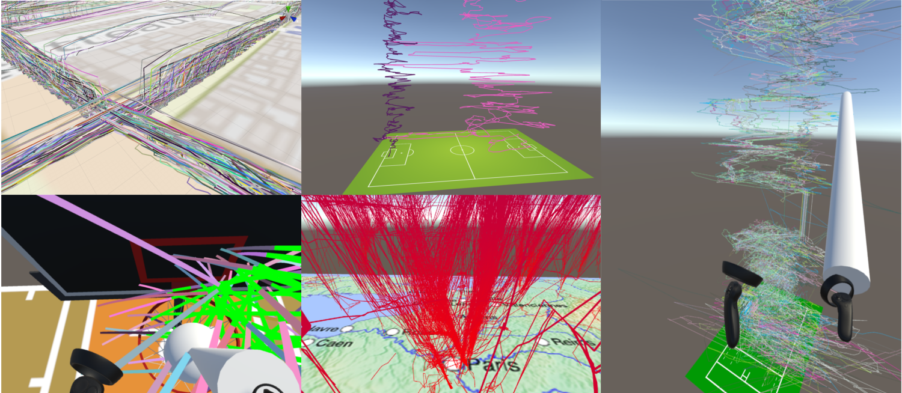

# ReViVD
**Github Repository - Stage2A - ReViVD (2020-2021)**
**Based on PAr118 - ReViVD (2018-2019)**

**Full name: 3D data exploration with Virtual Reality Headset (aircraft trajectories, sports data)**


## Objective
ReViVD's main objective is to develop new 3D data visualization and exploration tools in Virtual Reality. We intend to showcase methods of interacting with data in VR which are simply not possible in other desktop configurations.

## Docs
Some documentation can be found on our [website](https://amigocap.github.io/ReViVD/documentation/).

## JSON File Example
```
/*
json file example for tennis table data adapted create by me
This json file describes your binary file to let ReViVD know how to read your dataset and animation files.
*/
{
  //The path attribute names to use as id and/or as number of atoms, keep it void ("") if it doesn't apply to your dataset. The names must match with the ones in the path attributes array of this json.
  "pathAttributeUsedAs_id": "id",
  "pathAttributeUsedAs_n_atoms": "n",
  
  //The atom attribute names to use as x, y, z (mandatory) and/or as t and color, keep it void ("") if it doesn't apply to your dataset. The names must match with the ones in the atom attributes array of this json.
  "atomAttributeUsedAs_x": "x",
  //y attribute is the vertical axis (toward the sky)
  "atomAttributeUsedAs_y": "y",
  "atomAttributeUsedAs_z": "z",
  "atomAttributeUsedAs_t": "",
  "atomAttributeUsedAs_color": "",
  
  //Name of the binary file to load, must be in the same folder of this json file.
  "filename": "tennis",
  
  //If you have several binary files split by instants, turn the following option to true, set the number of instants per file and fill in the suffix of the first file (assuming that it is an incremental int)
  "severalFiles_splitInstants": false,
  "splitInstants_instantsPerFile": 50,
  "severalFiles_firstFileSuffix": "0001",
  
  //Binary endianness
  "endianness": "little",
  
  /* District size of the visualization
   * Used for collision detection optimization with selectors
   * Bigger districts are generally better for big selectors
   * Smaller districts are generally better for small selectors and very atom-dense visualizations
   * Try to fiddle around with those values if you find selection performance lacking.
   * Cubical districts are not mandatory but will go faster, especially on isotropic visualizations;
   * However, if a visualization is very atom-dense on only one axis, try reducing the district size on that axis.
   */
  "districtSize": {
    "x": 40.0,
    "y": 40.0,
    "z": 40.0
  },
  
  //Coordinates of the lower truncature point
  "lowerTruncature": {
    "x": -10000.0,
    "y": -10000.0,
    "z": -10000.0
  },
  
  //Coordinates of the upper truncature point
  "upperTruncature": {
    "x": 10000.0,
    "y": 10000.0,
    "z": 10000.0
  },
  
  //Number of paths in the entire dataset
  //Can be left blank / too large if unknown, at your own risks.
  "dataset_n_paths": 2,
  
  //Display all paths in the dataset if set to true. 
  "allPaths": true,
  
  //If allPaths is false, those paramaters handle the sampling of paths.
  "randomPaths": false,
  "chosen_n_paths": 4309,
  "chosen_paths_start": 0,
  "chosen_paths_end": 4309,
  "chosen_paths_step": 1,
  
  //Number of instants in the dataset, set it to a large number or leave it blank if unknown.
  //Will be overriden by pathAttributeUsedAs_n_atoms if it is defined.
  "dataset_n_instants": 2147483647,
  
  //Display all instants in the dataset if set to true. 
  "allInstants": true,
  
  //If allInstants is false, those paramaters handle the sampling of instants.
  "chosen_instants_start": 0,
  "chosen_instants_end": 200,
  "chosen_instants_step": 1,
  
  //If true x and z axis will be interpreted as latitude and longitude (decimal degree)
  "useGPSCoords": false,
  
  //Set the origin of the visualization to be at these specific GPS coordinates
  "GPSOrigin": {
    "x": 0.0,
    "y": 0.0
  },
  
  //Control of the parameters of the spheres animation: radius, animation speed, beginning time of the animation and if spheres are display.
  "spheresRadius": 0.05,
  "spheresAnimSpeed": 1.0,
  "spheresGlobalTime": 0.0,
  "spheresDisplay": false,
  
  //array of asset Bundles to load with the visualization, keep it empty ([]) if it doesn't apply to your dataset.
  "assetBundles": [
    {
	  //Name of the asset bundle
      "name": "tennistable_map",
	  
	  //Filename of the asset bundle to load, must be in the same folder of this json file.
      "filename": "tennistable_map",
	  
	  //If set to true, let you override the position, rotation and scale of the asset bundle.
      "overrideBundleTransform": false,
      "position": {
        "x": 0.0,
        "y": 0.0,
        "z": 0.0
      },
      "rotation": {
        "x": 0.0,
        "y": 0.0,
        "z": 0.0
      },
      "scale": {
        "x": 0.0,
        "y": 0.0,
        "z": 0.0
      }
    }
  ],
  
  //Path attributes array, keep it empty ([]) if it doesn't apply to your dataset.
  "pathAttributes": [
  {
      "name": "id",
      "type": "float32"
    },
	{
      "name": "n",
      "type": "float32"
	}
   ],
  
  //Atom attributes array.
  "atomAttributes": [
    {
      "name": "x",
      "type": "float32",
      "positionOffset": 0.0,
      "sizeCoeff": 1.0,
      "colorStart": "Blue",
      "colorEnd": "Red",
      "valueColorUseMinMax": true,
      "valueColorStart": 0.0,
      "valueColorEnd": 1.0
    },
    {
      "name": "y",
      "type": "float32",
      "positionOffset": 0.0,
      "sizeCoeff": 1.0,
      "colorStart": "Blue",
      "colorEnd": "Red",
      "valueColorUseMinMax": true,
      "valueColorStart": 0.0,
      "valueColorEnd": 1.0
    },
    {
      "name": "z",
      "type": "float32",
      "positionOffset": 0.0,
      "sizeCoeff": 1.0,
      "colorStart": "Blue",
      "colorEnd": "Red",
      "valueColorUseMinMax": true,
      "valueColorStart": 0.0,
      "valueColorEnd": 1.0
    }
  ],

  //the path of the CSV files containing player posture data, can be kept empty ([]) if there's no animation
  //all the attributs bellow won't be used if this attribut is left empty
  "CSVfilesPath": "D:/Documents/Blender/tennis/CSV",
  
  //the path to the videos, can be kept empty([]) if there are no videos
  "VideofilesPath" : "D:/Documents/Blender/tennis/Video",
  
  //the delay between each posture movement of the players
  //must not be <= 0
  "playersecondsBetweenUpdates" : 0.04,
  
  //the delay between each movement of the ball
  //must not be <= 0
  "ballsecondsBetweenUpdates" : 0.02,
  
  //the attributes of each player's posture animation
	"PlayerAnimationAttributes": [

  //Player 1
	{
    //line width
    //default value is 0.05
  "widthMultiplier": 0.05,
  
    //start of line color
    //default color is Blue
  "colorStart": "Blue",
  
    //end of line color
    //default color is Blue
  "colorEnd": "Blue",
  
    //player position offset
	"posOffset":{
        "x": 0.0,
        "y": 0.0,
        "z": 0.0
  },
  
    //show or not show the racket
    //default value is false
  "showPaddle" : false,
  
    //the first point of the direction that the racket must be oriented towards
  "paddlePos1": 13,
  
    //the second point of the direction that the racket must be oriented towards
	"paddlePos2": 14,
  },
  
  //Player 2
	{
	"widthMultiplier": 0.05,
	"colorStart": "Red",
	"colorEnd": "Red",
	"posOffset":{
        "x": 0.0,
        "y": 0.0,
        "z": 0.0
	},
	"showPaddle" : false,
	"paddlePos1": 13,
	"paddlePos2": 14,
	}
	]
}
```
